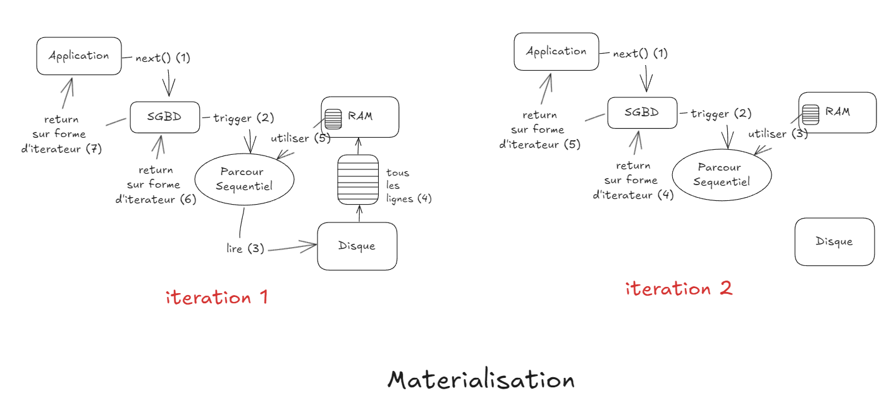
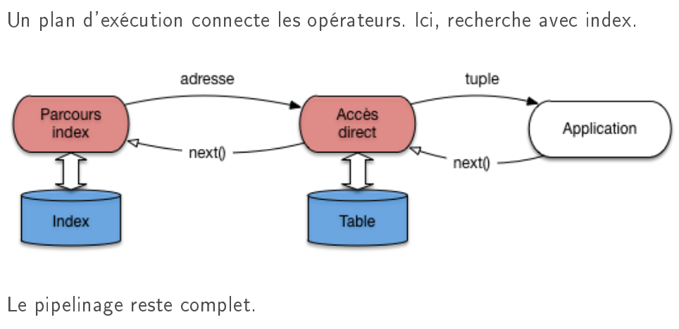
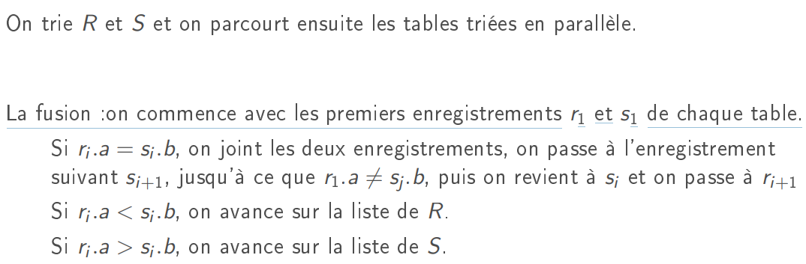
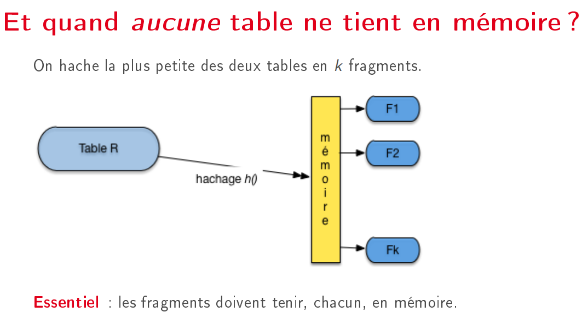
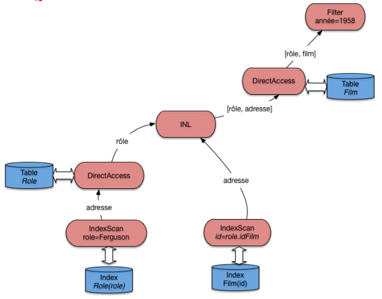
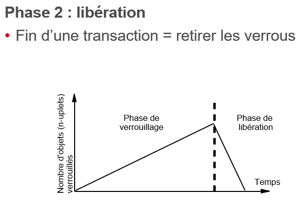
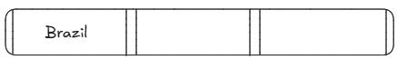

# Fichiers et Indexation

## Gestion des mémoires

- La structure hierarchique des fichiers est gérée par le système de fichiers:


- Operation de lecture: 
    - Si la donnée est fait partie du cache, elle est retournée directement ( *le SGBD prend le bloc, accède à la donnée et la retourne* )
    - Sinon, le SGBD accède au disque pour lire le bloc, le met en cache et retourne la donnée
    

- Hypothèse de localité: le SGBD garde en mémoire les blocs après utilisation, afin d'exploiter à la fois
    - la **localité spatiale** : les autres données du bloc.
    - la **localité temporelle** : la donnée sera probablement réutilisée.

- Le **hit ratio**: Le paramètre qui mesure l'efficacité d'une mémoire cache
    - $$ \text{Hit Ratio} = \frac{\text{nb\_lec\_logique} - \text{nb\_lec\_physique}}{\text{nb\_lec\_logique}} $$
    - If nb_lec_logique = nb_lec_physique ( *toutes les lectures logiques (demande de bloc) aboutissent à une lecture physique (accès au disque)* ), alors le hit ratio = 0
    - If nb_lec_physique = 0 ( *toutes les lectures logiques sont satisfaites par le cache* ), alors le hit ratio = 1
    - En pratique. Un bon Hit Ratio est supérieur à 80%, voire 90% : presque toutes les lectures se font en mémoire !
    - *Attention*: nb_lec_logique > nb_lec_physique, .
    - Pour avoir un bonne hit ratio:
        - Il faut allouer le plus de mémoire possible au SGBD
        - Limiter la taille de la base
        - Il faut que les données utiles soient en mémoire centrale: **certaines parties de la base sont beaucoup plus lues que d'autres**
- Stratégie de remplacement: LRU (Least Recently Used)
    
    - Conséquence : le contenu du cache est une image fidèle de l'activité récente sur la base de données.
- Operation mise à jour:
    - Approche naive: 
    - **Logging**: Optimal idea
        - For every update, record infos to allow to redo the update in case of failure
            - Sequential write to log file ( Seperate disk )
        - Log: An **ordered list** of all updates
        - Transactions are not considered complete until the corresponding changes are safely recorded in the write-ahead log.
        - Write ahead logging:
            - Force the log record for an update before the update itself
            - Sequential write to log file
        - Write to memory after log record
        - Write to disk ( opportunistically and randomly )
    

- Principe de localité: l'ensemble des données utilisées par une application pendant une période donnée forme souvent un groupe bien identifié.
    - **Localité spatiale** : si une donnée d est utilisée, les données proches de d ont de fortes chances de l'être également.
    - **Localité temporelle** : quand une application accède à une donnée d, il y a de fortes chances qu'elle y accède à nouveau peu de temps après.
    - **Localité de référence** : si une donnée d1 référence une donnée d2, l'accès à d1 entraîne souvent l'accès à d2.
### Questions:
- Que contient le cache ?
    - une copie de certains blocs de la base
    - des données d'une application utilisant le SGBD
- Un cache peut-il être plus grand que la base sur le disque ?
    - oui, et ça peut être utile
- Peut-il y avoir plus de lectures physiques que de lectures logiques ?
    - oui
- Une mise à jour se fait :
    - dans le cache, sans transfert immédiat
- Quel est le danger d'effectuer une mise à jour dans le cache et pas sur le disque ?
    - la mise à jour peut être perdue en cas de panne
- Parmi les arguments contre l'écriture immédiate d'un bloc contenant un enregistrement modifié, lequel vous semble faux ?
    - on évite d'écrire un bloc complet à chaque modification
    - on peut modifier un même enregistrement plusieurs fois de suite sans avoir à écrire sur le disque
    - on évite d'écraser des mises à jour faites par d'autres applications
    - **on peut changer d'avis et revenir à la version stockée sur le disque**


## Organisation des fichiers

- Enregistrements:
    - Un enregistrement = une suite de *champs* stockant les valeurs des attributs.
    
    - Certains champs ont une taille variable ; d'autres peuvent être à NULL : pas de valeur.
    - En-tete:
        - Exemple: 
            table Film (id INT, titre VARCHAR(50), année INT)
            Enregistrement (123, 'Vertigo', NULL)
            
            Contient: La **longueur de l'enregistrement** (entier sur *4 octets*, chaine de caractère de *7 octets*, longueur de la chaine sur *1 octet* **7+4+1=12**) puis **un masque indiquant** que le 3e attribut est NULL. Le contenu de l'enregistrement se décrypte au moment de la lecture.
- Bloc: Contients des enregistrement, l'addresse, ... ( a une structure indexation )
    - Exemple:
        
        - Avec le schéma précédent, l'adresse d'un enregistrement est constituée
            - D'une adresse physique, celle du bloc. Ex : F1.12
            - D'une adresse logique, interne au bloc. Ex : 16
    - What happen if an enregistrement is too large to fit in a block ?
        - **Un enregistrement s'agrandit, mais qu'il reste de la place dans le bloc**: On modifie l'organisation interne ; la table locale d'adressage est modifiée
        - Un enregistrement s'agrandit, plus de place dans le bloc: on déplace l'enregistrement et on crée un chaînage dans l'en-tête du bloc
        - La création de chaînage **pénalise** les performances
        
    
- Fichier: Contient des blocs
    - Si les blocs sont très dispersés sur le disque, on aboutit à une fragmentation très pénalisante.

### Questions:
- Quelle est la différence entre un champ de type varchar(25) et un champ de type varchar(250) ?
    - le système refusera de stocker dans le premier une chaîne de plus de 25 octets
    - l'entête de l'enregistrement sera plus volumineuse pour le second
    - **le premier occupe 10 fois moins de place**
- Je représente l'adresse d'un enregistrement par son numéro de bloc B, et son numéro interne au bloc i (schéma d'indirection, vu ci-dessus). Quelle réponse est vraie ?
    - je peux aller lire directement l'enregistrement sur le disque
    - l'enregistrement est toujours en position i dans le bloc
    - **je dois d'abord lire le bloc avant de trouver l'enregistrement**

## Structure indexation

1. Index:
- Concept: In a database, an index is a **data structure** that *improves the speed of data retrieval* operations on a table at the cost of additional writes and storage space.
- Informatiques: C'est **un fichier** qui permet de trouver un enregistrement dans une table.
    - **Clé d'indexation** = **une liste** *d'un ou plusieurs attributs*.
    - **Une adresse** (déjà vu) est *une adresse de bloc ou une adresse d'enregistrement*.
    - Entrée d'index : enregistrements **de la forme [valeur, addr]**, valeur est une valeur de clé.
    - L'index est **trié** sur valeur
- Exemples:
    - Clés de recherche :
        - Le titre du film (c'est aussi la clé primaire)
        - l'année du film
    - Opérations :
        - Rechercher Vertigo
        - Rechercher les films parus entre 1960 et 1975
        - Rechercher les films commençant par 'V'
- *L'index ne sert à rien pour toute recherche ne portant pas sur la clé.*
- Types d'index:
    - Index non dense: le fichier de données est **trié sur la clé**, comme un dictionnaire. *L'index ne référence que la première valeur de chaque bloc*.
        
        - Hypothèse : le **fichier de données** est **trié** sur la clé, comme un dictionnaire. L'index ne référence que **la première valeur** de chaque bloc.
        - Operations:
            - Par clé: *je recherche Shining*
            - Par intervalle: *tous les films entre Greystocke et Psychose.*
            - Par recherche de préfixe: Par préfixe : tous les films commençant par 'M'.
            - Exemple concret
                
                Sur notre fichier de 1,2 Go
                - En supposant qu'un titre occupe 20 octets, une adresse 8 octets
                - Un bloc de 4 Ko
                - On a toujours 300.000 blocs pour stocker l'intégralité de la base
                - **Taille de l'index** : 300 000 ∗ (20 + 8) = 8, **4Mo** octets
                Processus de lecture (index sur le titre du film) :
                1- On parcourt l'index (qui peut être en mémoire !) pour trouver l'adresse du bloc
                2- On lit le bloc en question
                3- On parcourt en mémoire le bloc pour trouver le film
                Le coût en terme d'I/O disque est O(1).


    - Index dense: *L'index référence chaque enregistrement*.
        
        - Fichier de données **non trié**. **Toutes les valeurs de clé sont représentées**
        - Engendre des accès aléatoires
        - Exemple concret
            
            Sur notre fichier de 1,2 Go
            - Une année = 4 octets, une adresse 8 octets
            - Taille de l'index : borné par 1 000 000 ∗ (4 + 8) = 12 Mo (si chaque film a une année différente), ou plus précisément 1 000 000 ∗ 8 + |annes| ∗ 4
            Encore 100 fois plus petit que le fichier.
            Recherches :
            - Par clé : comme sur un index non-dense
            - Par intervalle (exemple [1950, 1979]) :recherche, dans l'index de la borne inférieure parcours séquentiel dans l'index
            à chaque valeur : accès au fichier de données
            Engendre des accès aléatoires.
        ```
    - Index multi-niveaux
        
        - Essentiel : l'index est trié, donc on peut l'indexer par un second niveau *non-dense*
        - Si tous les niveaux étaient denses, ils auraient tous la même taille *O(n)* où *n* est le nombre d'enregistrements -> il faut que l'index soit trié.
        - Arrêt quand racine constitué d'un seul bloc.
        - Structure hiérarchique ; recherche de haut en bas.
- L'index **accélère les requêtes de recherche**, mais **ralentit les requêtes de mise à jour**. ( *il a un cout* )

### Questions:
- Qu'appelle-t-on une entrée d'index ?
    - un enregistrement de l'index, de la forme (clé, adresse)
    - l'intervalle de valeur couvert par les clés d'un même bloc
    - l'intervalle entre deux clés de l'index
    - le premier bloc de l'index
- Combien d'index non denses peut-on créer sur un fichier de données
    - au plus 1
    - exactement 1
    - autant qu'on veut
- Quel type d'index est mieux adapté à un dictionnaire ?
    - dense
    - non-dense
- Je dispose d'un index non-dense sur le titre des films. Est-ce que cet index me sera utile pour exécuter la requête SELECT * FROM FILMS WHERE TITRE <> "Matrix"
    - oui
    - non

## Arbres B+

### Concept
Aboutissement des structures d'index basées sur l'ordre des données
- c'est un arbre équilibré
- chaque n÷ud est un index local
- il se réorganise dynamiquement

- Un noeud feuille est un index dense local, contenant des entrées d'index.
- Chaque entrée référence un (ou plusieurs) enregistrements du chier de données : celui (ceux) ayant la même valeur de clé
que l'entrée

- Un n÷ud interne est un index non dense local, les enregistrements servant de clé, intercalés avec des pointeurs.

- Exemple:
    - Fichier 1M de films
    - Admettons qu'une **entrée d'index** occupe 12 octets, soit 8 octets pour l'adresse, et 4 pour la clé (l'année du film).
    - Chaque bloc contient 4 096 octets
    - On place donc 4096/12 = 341 **entrées** (au maximum) *dans un bloc*.
    - Il faut 1000000/341 = 2932 **blocs** pour le niveau des feuilles
    - Le deuxième niveau est non dense. Il comprend autant d'entrées que de blocs à indexer, soit 2932. Il faut donc 2932/341 = 8 blocs (au mieux).
    - Finalement, un troisième niveau, constitué d'**un bloc avec 8 entrées** sufft pour compléter l'index.

### Insert:
Supposons que le bloc contient seulement 2 entrées.


### Recherche
- Recherche par clé
    ```sql
    SELECT * FROM Film WHERE titre = 'Manhattan';
    ```
    - on lit la racine de l'arbre : Manhattan étant situé dans l'ordre lexicographique entre Easy Rider et Psychose, on doit suivre le chaînage situé entre ces deux titres ;
    - on lit le bloc intermédiaire, on descend à gauche ;
    - dans la feuille, on trouve l'entrée correspondant à Manhattan ;
    - il reste à lire l'enregistrement.

- recherche par intervalle
    ```sql
    select *
    from Film
    where annee between 1960 AND 1975
    ```
    - On fait une recherche par clé pour l'année 60
    - on parcourt les feuilles de l'arbre en suivant le chaînage, jusqu'à l'année 1975
    - à chaque fois on lit l'enregistrement
- Recherche par préfixe
    ```sql
    SELECT *
    FROM Film
    WHERE titre LIKE 'M\%'
    ```
    
    Revient à une recherche par intervalle.
    ```sql
    SELECT *
    FROM Film
    WHERE titre BETWEEN 'MAAAAAA...' AND 'MZZZZZZ...'
    ```
    Contre-exemple :
    ```sql
    SELECT *
    FROM Film
    WHERE titre LIKE '\%e'
    ```
    Ici index inutilisable


### Creation arbre B+
- Sur la clé primaire.

<!-- ```sql
create table Film (titre varchar(30) not null,
...,
primary key (titre)
);
``` -->

- Sur n'importe quel attribut.

```sql
create index filmAnnee on Film (annee)
```

Le SGBD synchronise le contenu de la table et celui de l'index
    
### Efficacité de l'arbre B+
Il est (presque) parfait !
- On a très rarement besoin de plus de trois niveaux
- Le coût d'une recherche par clé est le nombre de niveaux, plus 1.
- Supporte les recherches par clé, par intervalle, par préfixe
- Dynamique
On peut juste lui reprocher d'occuper de la place. Il existe aussi les arbres B qui
sont comme les arbres B+ sauf qu'on peut mettre un pointeur dans des
noeuds internes et pas seulement dans les feuilles (cf TD).

### Questions:

- Combien peut-on créer d'index en forme d'arbre B+ sur une table ?
    - un seul, car l'arbre B+ est non dense
    - deux, celui sur la clé primaire, et celui sur un autre attribut au choix
    - un pour chaque clé (primaire et étrangère)
    - autant que l'on veut
- Le chaînage des feuilles est utile pour ?
    - la procédure d'éclatement des feuilles
    - le maintien de la cohérence globale de l'arbre
    - la procédure de recherche par intervalle

- La recherche pour une valeur de clé, dans un arbre B+
    - s'effectue en suivant un unique chemin de la racine vers une feuille
    - s'effectue en parcourant séquentiellement les feuilles
    - s'effectue en trouvant le premier bloc, interne ou feuille, dont une entrée correspond à la valeur de la clé recherchée


## Le hachage
- Concurrent avec l'arbre B+
    - Meilleur (un peu, et en théorie) pour les recherches par clé
    - N'occupe aucune place
    - Se réorganise difficilement
    - Ne supporte pas les recherches par intervalle

- Principle: Le stockage est organisé en **N fragments (buckets)** constitués de séquences de blocs.
    - La répartition des enregistrements se fait par un **calcul**
    - Une **fonction de hachage h**: **prend une valeur de clé en entrée** et **retourne une adresse de fragment en sortie**
        - Stockage : on calcule l'adresse du fragment d'après la clé, on y stocke l'enregistrement
        - Recherche (par clé) : on calcule l'adresse du fragment d'après la clé, on y cherche l'enregistrement

- Exemple: 
    - On veut créer une structure de hachage pour nos 16 films
    - Chaque fragment fait un bloc et contient 4 enregistrements au plus
    - on alloue 5 fragments (pour garder une marge de man÷uvre)
    - un répertoire à 5 entrées (0 à 4) pointe vers les fragments
    - On définit la fonction h(titre) = rang(titre[0]) mod 5
        - Donc on prend la première lettre du titre (par exemple 'I' pour 'Impitoyable'), on prend sot rang dans l'alphabet (ici 9) et on garde le reste de la division par 5, le nombre de fragments.
        *h('Impitoyable') = 9 mod 5 = 4*
    
- Recherche compatible:
    - Par clé , **Oui**
        *SELECT * FROM Film WHERE titre = 'Impitoyable'*
    - Par préfixe ? **Non**
        *SELECT * FROM Film WHERE titre LIKE 'Mat%'*
    - Par intervalle : **non !** 
        *SELECT *
        FROM Film
        WHERE titre BETWEEN 'Annie Hall' AND 'Easy Rider'*
- Très important : h doit répartir **uniformément** les enregistrements dans les n fragments
- Difficulté: si une majorité de films commence par **une même lettre** (*'L' par exemple*) la répartition va être déséquilibrée.
- Plus grave : La structure simple décrite précédemment n'est pas dynamique.
    - On ne peut pas changer un enregistrement de place
    - Donc il faut créer un chaînage de blocs quand un fragment déborde
    - Et donc les performances se dégradent...
    
### Question

À quoi sert le répertoire de la structure de hachage ?
R0 À stocker les enregistrements d'après leur clé c
R1 À stocker l'adresse des enregistrements d'après la valeur de h(c)
R2 À stocker l'adresse des fragments d'après la valeur de h(c)

Ma clé primaire est un identifiant séquentiel. Que peut-on dire du stockage de deux
enregistrements consécutifs ?
R0 Les emplacements des enregistrements sont complètement indépendants.
R1 Ils sont forcément dans deux fragments distincts.
R2 Ils sont dans le même fragment, ou au pire dans deux fragments ajacents.

Quelle est, dans le pire des cas, le coût d'une recherche par clé dans une structure de
hachage statique ?
R0 Dans tous les cas une lecture suffit.
R1 Dans le pire des cas il faut deux lectures, une pour le fragment principal, l'autre
pour le fragment chaîné.
R2 Dans le pire des cas, on aura |base|/|fragment| lectures à effectuer.
R3 Dans le pire des cas tous les fragments sont chaînés et le coût est identique au
parcours du fichier.

## Le hashage extensible
- Le hachage extensible permet de réorganiser la table de hachage en fonction des insertions et suppressions.
- Principe la fonction de hachage h est fixe, mais on utilise les **n premiers bits** du
résultat h(c) pour s'adapter à la taille de la collection.
- Par rapport à la version de base du hachage, on ajoute deux contraintes:
    - Nombre d'entrées dans le répertoire est une puissance de 2
    - Fonction h donne toujours un entier sur 4 octets (32 bits)
- Exemple:
    
    - Supposons 3 films par fragment. L'insertion de Psychose (valeur 01110011) entraîne le débordement du premier fragment.
        - On double la taille du répertoire : quatre entrées 00, 01, 10 et 11.
        - On alloue un nouveau fragment pour l'entrée 01
        - Les entrées 10 et 11 pointent sur le même fragment
    - Le répertoire grandit, mais dans l'espace de stockage on ajoute seulement un nouveau fragment.
    
    Cas 1 : on insère dans un fragment plein, mais plusieurs entrées pointent dessus ⇒ on alloue un nouveau fragment, et on répartit les pointeurs
    
    Cas 2:  on insère dans un fragment plein, associé à une seule entrée ⇒ on double à nouveau le nombre d'entrées
    
- Le hachage extensible résout en partir le principal défaut du hachage, l'absence de dynamicité.
- Le répertoire tend à croître de manière exponentielle, ce qui peut soulever un problème à terme.
- Il reste une structure plaçante qui doit être complétée par l'arbre B pour des index secondaires.

### Question
Qu'est-ce qui caractérise le hachage extensible ?
R0 Les fragments sont de taille variable
R1 Le répertoire est de taille variable
R2 La fonction de hachage change régulièrement

Combien ajoute-t-on de fragments au moment quand l'un d'eux déborde ?
R0 1
R1 2
R2 p où p est le nombre d'entrée courant dans le répertoire
R3 2^(p−1) où p est le nombre d'entrée courant dans le répertoire
R3 2^p où p est le nombre d'entrée courant dans le répertoire

Combien d'entrées du répertoire peuvent référencer le même fragment ?
R0 1
R1 2
R3 log(p) où p est le nombre d'entrée courant dans le répertoire
R4 p/2 où p est le nombre d'entrée courant dans le répertoire
R5 p où p est le nombre d'entrée courant dans le répertoire


# Execution - Optimisation requetes

- Une requête SQL est **déclarative**. Elle ne dit pas **comment** calculer le résultat
- Dans un SGBD le *programme* qui exécute une requête est appelé **plan d'exécution**.
- **Plan execution**: c'est un **arbre**, constitué *d'opérateurs*.
- Deux étapes :
    - (A) plan d'exécution **logique** (l'algèbre) ;
    - (B) plan d'exécution **physique** (opérateurs).
    
- Optimisation: À chaque étape, plusieurs choix. Le système les évalue et choisit le meilleur.


## Operateur physiques:
### **Operateur**: 
- Forme **generique**:
- Avoir un tache
- **Bloquant** et **non bloquant**
### Blocage: 
- **Materielisation**: stocker le résultat d'une requête intermédiaire

- **Pipelinage**: 

- **Temps réponse, temps d'execution**:

- Exemple:
    - **Blocage**: 
        - Tri (Order by)
        - Partitionnement (Group by) avec fonction d'agrégation (max, min, sum, avg)
        - Elimination de doublons (distinct) (opérateur dit semi-bloquant)
    - **Non blocage**:

### FullScan
- Au moment du open(), le curseur est positionné avant le premier nuplet

- Le premier next() entraîne l'accès au premier bloc, placé en mémoire.

- Le curseur se place sur le premier nuplet, qui est retourné comme résultat. Le temps de réponse est minimal.
- Le deuxième next() avance d'un cran dans le parcours du bloc.


### Execution une requete = avancer un curseur

### Notion iterateur
Chaque opérateur est implanté sous forme d'un itérateur.
Trois fonctions :
- **open** : initialise les tâches de l'opérateur ; positionne le curseur au début du résultat à fournir ;
- **next** : ramène l'enregistrement courant se place sur l'enregistrement suivant ;
- **close** : libère les ressources ;
Connexion :
- Un itérateur consomme des tuples d'un ou deux autres itérateurs.
- Un itérateur produit des tuples pour un autre itérateur (ou pour l'application).
Exemple:


## Some Operateur:

### IndexScan
**Return an address** ( of a block on disk )
- Implementation

- Execution:

- Code:


### DirectAccess
It **take an address** and access directly, **return a tuple**
- Implementation:
    - open(): Rien à faire
    - next(): Recoit addresse, access le bloc, utilise address local pour trouver le tuple et retourne un n-uplet




### Filter
Il prends une tuple et retourne une tuple


### Exemple


### Question
L'opérateur de parcours d'index IndexScan fournit, à chaque appel next()
R0 un n-uplet
R1 l'ensemble des n-uplets du résultat
R2 l'adresse d'un n-uplet
R3 l'ensemble des adresses des n-uplets du résultat

Soit la requête Select count(*) from Film where annee between 2015 and 2020. Cette requête a besoin d'utiliser (outre le calcul de l'agrégat) :
R0 indexscan
R1 direct access
R2 indexscan et direct access

Dans le plan d'exécution suivant, peut-on inverser les opérateurs d'accès direct et de filtre ?
R0 oui
R1 non

### Tri par fusion
- Concept
    
    - Given the fichier of B blocks
    - Given the memory capaciry of M blocks
    - The fichier is divided to n = B/M fragments
    - For n fragments, the memory read from the disk ( **1 lecture complet** ), sort ( quicksort ) and write back to the disk ( **1 ecriture complet**)
    - We take the first block of each fragment ( we take the first element of all fragments if the number of fragment is smaller than M, we take the first element of just M-1 fragments if the number of fragments is greater or equal to M ) and put them in the memory. ( **1 lecture complet**)
    - We find the smallest element and return ( if the number of fragment is smaller than M ) or write it back to the disk ( if the number of fragment is greater or equal to M (**1 ecriture complet**) ). We take the next element from the fragment that contains the smallest element and put it in the memory. We repeat the process until we finish all the elements.
    - We repete until there is only one fragment.
    - Number of read/write:
        - Initialisation, quicksort: 1 lecture complet.
        - For each merge sort: 1 ecriture complet, 1 lecture complet
    - Taille:
        - Fichier a: n = B/M fragments
        - Donc on a besoin de k = logM-1(n) fois de fusionner les fragments
        - Taille maximale de chaque fragment après le merge sort numero i:
            - i = 0: M
            - i = 1: M(M-1)
            - i = 2: M(M-1)^2
            - i = k: M(M-1)^k = Mxn ( *le fichier est trié* )
    - Total number of read and write: 1 lecture + k ecriture + k lecture = 1 lecture + 2logM-1(n) ecriture + 2logM-1(n) lecture

- Operation:
    - Non bloquant
    - open(): Produire resultats ( Collection des tuples trié (*Sur disque ou memoire ?* ) )
    - next(): ne fait que lire, un à un, les tuples dans le résultat du tri


### Jointure
- Jointure avec index
    - Algorithme de jointure par boucles imbriquées indexées.
- Jointure sans index
    - Le plus simple : boucles imbriquées (non indexée).
    - Le plus courant : jointure par tri-fusion.
    - Plus sophistiqué : la jointure par hachage.

#### Jointure index:


Avantages :
- Efficace (un parcours, plus des recherches par adresse)
- Favorise le temps de réponse et le temps d'exécution

#### Jointure boucle imbriqué:


#### Jointure par tri-fusion:
Plus effcace que les boucles imbriquées pour de grosses tables.
- On trie les deux tables sur les colonnes de jointures
- On effectue la fusion

Opérateur **bloquant**: on ne peut rien obtenir tant que le tri n'est pas fini.

Illustration

Operator


#### Jointure par hachage:





Un opérateur potentiellement coûteux. Quelques principes généraux :
- Si une table tient en mémoire : jointure par boucle imbriquées, ou hachage.
- Si au moins un index est utilisable : jointure par boucle imbriquées indexée.
- Si une des deux tables beaucoup plus petite que l'autre : jointure par hachage.
- Sinon : jointure par tri-fusion.

Décision très complexe, prise par la système en fonction des statistiques.

## Plan d'execution
Toute requête SQL est traitée en trois étapes :
- Analyse et traduction de la requête. On vérifie qu'elle est correcte, et on l'exprime sous forme d'opérations.
- Optimisation : comment agencer au mieux les opérations, et quels algorithmes utiliser. On obtient un plan d'exécution.
- Exécution de la requête : le plan d'exécution est compilé et exécuté.

Le traitement s'appuie sur les éléments suivants :
- Le schéma de la base, description des tables et chemins d'accès (dans le
catalogue)
- Des statistiques : taille des tables, des index, distribution des valeurs
- Des opérateurs : il peuvent différer selon les systèmes
Important : on suppose que le temps d'accès à ces informations est négligeable par
rapport à l'exécution de la requête.


Traitement d'un bloc
Plusieurs phases :
- Analyse syntaxique : conformité SQL, conformité au schéma.
- Analyse de cohérence : pas de clause comme annee < 2000 and annee > 2001
Si OK, traduction en une expression algébrique, plus "opérationnelle" que SQL.

*Toute requête SQL se réécrit en une expression de l'algèbre.*


Est-ce que la phrase suivante est vraie : Comme SQL est déclaratif, je peux écrire la requête comme je veux (à plat ou avec des imbrications), j'aurais les mêmes n-uplets dans le résultat.
R0 oui
R1 non

Est-ce que la phrase suivante est vraie : Comme SQL est déclaratif, je peux écrire la requête comme je veux (à plat ou avec des imbrications), le calcul prendra le même temps.
R0 oui
R1 non

## Optimisation 
Rôle de l'optimiseur :
- Trouver les expressions équivalentes à une requête.
- Les évaluer et choisir la meilleure.
On convertit une expression en une expression équivalente en employant des règles de réécriture.


Le plan d'exécution

Et si j'indexe le nom du rôle ?

Et si j'indexe la clé étrangère ?

Et si je n'ai pas d'index ?


# Transactions
On appelle transaction un ensemble séquentiel cohérent d'opérations sur une base de données.

Nombreuses transactions en parallèle. La durée d'une transaction peut être très courte (génération automatique)
Besoin pour le SGBD d'être capable de les gérer. Eviter :
- Pertes d'opérations / introduction d'incohérences
- Observation d'incohérences
- Lectures non reproductibles / lectures fantômes

- Atomicité : Toutes les MAJ sont éxécutées ou aucune
- Cohérence : Passer d'un état cohérent à un autre
- Isolation : La transaction s'effectue comme si elle était seule
- Durabilité : Une fois une transactions validée, son effet ne peut pas être perdu suite à une panne quelconque

## Sériablilité
- Une transaction = une séquence d'opérations.
- Transactions sérielles = exécuter toute la transaction T1 puis T2 etc… = pas de problème !
- Deux opérations a et a', exécutées respectivement par deux transactions différentes T et T' sont dites **conflictuelles** si l'exécution des deux séquences a;a' (a puis a') et a';a (a' puis a) est susceptible de conduire à des résultats différents.

- L'ordonnancement: Un ordonnancement d'opérations de plusieurs transactions est composé d'opérations atomiques de type R ou W sur des données.
Exemple:

Définition : Un ordonnancement A est **équivalent** à un ordonnancement A' ssi le résultat produit et observé est le même.
Proposition : Si A' est un ordonnancement produit à partir d'un ordonnancement A en ne **permutant** que des opérations non conflictuelles alors A et A' sont équivalentes.

Un ordonnancement est sérialisable si et seulement si : Il peut être transformé en un ordonnancement série par permutations successives d'opérations ne constituant pas une paire d'opérations conflictuelles.
Une telle transformation, si elle est possible, fournit effectivement un ordonnancement série équivalent


- Graphe de précédence de l’exécution: sérialisable ou non
    - Sur chaque objet, deux actions non permutables impliquent une relation de précédence entre les transactions correspondantes
    - Décision : Graphe de précédence sans boucle  exécution sérialisable (il suffit de suivre les arcs) 

## Verrouillage: Eviter Deadlock
Phase 1 : Verrouillage
- Lecture : Verrou « S » (Shared)
- Ecriture : Verrou « X » (Exclusive)



Verrou mortel (cycle) ou « Deadlock »: Transactions qui s’attendent mutuellement


Types de verrous:


# TD

## TD1

- Premier: Arbres B+ ( Recherche par intervalle )
- Deuxième: Arbre B+, Hachage ( Plus optimal ssi ya une table qui est si petit qu'il contient dans mémoire )




## TD2

## Project

## Optimisation request
- En appliquant la requête à la base Minus, vous devriez obtenir un plan d'exécution de la forme
 Parcours séquentiel de film (temps de réponse:0.00 ; temps d'exécution:7.10 ; nombre de nuplets:20 ; mémoire allouée:15)
filter: (annee >= 2000) 
Un index est-il utilisé pour ce plan d'exécution? **Non**
- La table Film doit nécessairement être parcourue séquentiellement. **Non**
- Est-ce qu'in index sur l'année améliore le temps d'exécution? **Pas forcément**
- Déterminez les requêtes qui vont introduire un opérateur bloquant dans le plan d'exécution.
    - select titre from Film order by annee
    - **select max(annee) from Film where annee >= 2000**
    - select annee - 2000 from Film
    - **select annee, count(*) from Film group by annee**
    - **select distinct annee from Film**
- Quelle méthode emploie Postgres pour trouver les doublons et les éliminer?
    - **Le hachage**
    - Le tri
    - Le parcours séquentiel
    - La construction d'index
- Quelle valeur nous confirme que l'opérateur est bloquant? **Le temps de réponse**
- L'existence d'un index peut-elle éviter de recourir à un opérateur bloquant pour les requêtes ci-dessus? **Non**
- Voici un ensemble de requêtes. Indiquez celles pour lesquelles il est possible d'utiliser un index. Rappelons que toutes les clés primaires sont indexées par un arbre B, que la clé primaire de Film est l'attribut id, et que la clé primaire de Rôle est la paire (id_film, id_acteur).
    - **select * from Film where id=34**
    - select * from Film where id_realisateur=65
    - select * from Film where titre='Alien'
    - **select * from Role where id_film=34 and id_acteur=65**
    - **select * from Role where id_film=34**
- Regardez le plan d'exécution pour la requête ``select * from Film where id+1=35`` sur la base Magnus. Que constate-t-on ? 
**Postgres renonce à utiliser l'index.**

## Projet


- Table simple
```java
public class TableSimple extends Instrumentation implements Operateur{
	private Vector<Tuple> contenu;
	int compteur = 0;
	int taille = 0;
	int range = 2;
	long total;
	public TableSimple() {
		super("FullScan"+Instrumentation.number++);
		this.contenu = new Vector<Tuple>();
		this.total = 0;
	}
	public void randomize(int tuplesize, int tablesize) {
		for(int i=0;i<tablesize;i++) {
			Tuple t = new Tuple(tuplesize);
			for(int j=0;j<tuplesize;j++) {
				t.val[j]=(int)(Math.random()*this.range);
			}
			this.contenu.add(t);
		}
		this.taille = this.contenu.size();
	}
	public void open() {
		this.start();
		this.compteur = 0;
		this.tuplesProduits = 0;
		this.memoire = 0;
		this.stop();
	}
	public Tuple next() {
		this.start();
		if(this.compteur<this.taille) {
			Tuple t = this.contenu.elementAt(this.compteur++); 
			this.produit(t);
			this.stop();
			return(t);
		}
		else {
			this.stop();
			return null;
		}
	}
	public void close(){
		this.total+=this.tuplesProduits;
	}
}
```
Table Disque
```java
public class TableDisque implements Operateur {
	private String filePath= "";
	private int taille = 0;
	private int tupleSize = 0;
	private int range = 100;
	private int blockSize = 4;
	private int blockCursor = 0;
	private int memorySize = 3; // nombre de blocs
	private TupPos[][] cache = new TupPos[memorySize][blockSize];
	private Queue<Integer> q = new LinkedList<Integer>(); // pour g�rer les blocs en m�moire
	private int currentMemoryBlock=0;
	private FileWriter myWriter;
	private FileReader myReader;
	private Boolean start = true;
	public int reads = 0;
	public void open() {
		this.openFile();
		this.start = true;
		q = new LinkedList<Integer>();
		cache = new TupPos[memorySize][blockSize];
	}
	public void close(){
		try {
			this.myReader.close();
		} catch (IOException e) {
			// TODO Auto-generated catch block
			e.printStackTrace();
		}
	}	
	public Tuple next() {
		if(this.start || this.blockCursor == this.blockSize) {
			this.readNextBlock();
			this.blockCursor = 0;
			this.start = false;
		}
		return(this.cache[this.currentMemoryBlock][this.blockCursor++]);			
	}
	public void openFile() {
		try {
			this.myReader = new FileReader(filePath);
			this.taille = this.myReader.read(); // header : table size puis tuplesize
			this.tupleSize = this.myReader.read(); // header : table size puis tuplesize			
		}catch (IOException e) {
		      System.out.println("Erreur de lecture");
		      e.printStackTrace();
		}		
	}
	public void readNextBlock() {
		int i=0;
		try {
		if(q.size()<this.memorySize) {
			this.currentMemoryBlock = q.size();
			q.add(q.size());
		}else {
			int lastBlock = q.remove(); 
			this.currentMemoryBlock = lastBlock;
			q.add(lastBlock);
		}
		for(i=0;i<this.blockSize;i++) {
			TupPos t = new TupPos(this.tupleSize);
			for(int j=0;j<this.tupleSize;j++) {
				t.val[j] = this.myReader.read();
			}
			if(t.val[0] != -1)
				this.cache[this.currentMemoryBlock][i] = t;
			else
				this.cache[this.currentMemoryBlock][i] = null;
		}
		System.out.println ("Block read : "+this.currentMemoryBlock);
		this.reads++;
		}catch (IOException e) {
				System.err.println("Erreur de lecture.");
		}
	}
	public void randomize(int tuplesize, int tablesize) {
		try {
	    this.myWriter = new FileWriter(filePath); 
		this.myWriter.write(tablesize); // header : table size puis tuplesize
		this.myWriter.write(tuplesize); // header : table size puis tuplesize
		for(int i=0;i<tablesize;i++) {
			Tuple t = new Tuple(tuplesize);
			for(int j=0;j<tuplesize;j++) {
				t.val[j]=(int)(Math.random()*this.range);
				this.myWriter.write(t.val[j]);
			}
		}
        myWriter.close();
        System.out.println("Table g�n�r�e");
		this.taille = tablesize;
		} catch (IOException e) {
		      System.out.println("Erreur de cr�ation ou d'�criture de fichier.");
		      e.printStackTrace();
		}
	}
	public TupPos getTuple( int nb_bloc, int pos){
		this.openFile();
		try {
//			for( int i = 0 ; i < this.memorySize; i++){
//				for (int j = 0; j < this.blockSize; j++){
//					if ( this.cache[i][j].index[0] == nb_bloc && this.cache[i][j].index[1] == pos){
//						return this.cache[i][j];
//					}
//				}
//			}
		for ( int i = 0; i < (nb_bloc-1)*this.blockSize; i++ ){
			for( int j = 0; j < this.tupleSize; j++) {
				int temp = this.myReader.read();
			}
		}
		for ( int i = 0 ; i < pos - 1; i++ ){
			for( int j = 0; j < this.tupleSize; j++) {
				int temp = this.myReader.read();
			}
		}
		TupPos t = new TupPos(this.tupleSize);
		t.index[0] = nb_bloc;
		t.index[1] = pos;
		for ( int i = 0 ; i < this.tupleSize; i++) {
			t.val[i] = this.myReader.read();
		}
		return t;
		}catch (IOException e) {
			System.out.println("Erreur de lecture");
			e.printStackTrace();
		}
		return null;
	}
}
```
- AVG
```java
public class AVG extends Instrumentation implements Operateur{

    private int col;
    private Operateur op1;

    private Tuple avg;
    int compteur = 0;

    public AVG (Operateur op1, int col){
        super("Avg"+Instrumentation.number++);
        this.start();
        this.op1 = op1;
        this.col = col;
        this.avg = null;
        this.stop();

    }
    @Override
    public void open(){
        this.start();
        this.op1.open();
        this.tuplesProduits = 0;
        this.memoire = 0;
        Tuple temp = null;
        int comp = 0;
        int sum = 0 ;
        while((temp = this.op1.next()) != null){
            sum += temp.val[this.col];
            comp ++;
        }
        if (comp != 0) {
            this.avg = new Tuple(1);
        }
        this.avg.val[0] = (int) (sum / comp);
        this.stop();
    }
    @Override
    public Tuple next(){
        this.start();
        if(this.avg == null){
            this.stop();
            return null;
        }
        Tuple t = new Tuple(1);
        t.val[0] = this.avg.val[0];
        this.avg = null;
        this.produit(t);
        this.stop();
        return t;
    }
    public void close(){
        this.op1.close();
    }
    
}
```
- DISTINCT
```java
public class Distinct extends Instrumentation implements Operateur{

    private Vector<Tuple> temp;
    private Operateur in;
    long total;
    public Distinct(Operateur in){
        super("Distinct"+Instrumentation.number++);
        this.in = in;
        this.temp = new Vector<Tuple>(0);
    }
    @Override
    public void open(){
        this.start();
        this.in.open();
        this.tuplesProduits = 0;
        this.memoire = 0;
        this.stop();
    };
    public Tuple next(){
        this.start();
        Tuple t = null;
        while ( (t = this.in.next()) != null ){
            if ( is_Duplicated(this.temp, t)){
                this.stop();
                return this.next();
            } else{
                this.produit(t);
                this.temp.add(t);
                this.stop();
                return t;
            }
        }
        this.stop();
        return t;
    };
    public void close(){
        this.in.close();
    };
    private boolean ligne_identique( Tuple t1, Tuple t2){
        for( int i = 0; i < t1.size; i++ ){
            if ( t1.val[i] != t2.val[i]){
                return false;
            }
        }
        return true;
    }
    private boolean is_Duplicated( Vector<Tuple> v, Tuple t){
        if (v == null){
            return false;
        }
        for ( int i = 0 ; i< v.size(); i++){
            if ( ligne_identique(v.elementAt(i), t)) {
                return true;
            }
        }
        return false;
    }
}
```
- Boucle imbriqué
```java
public class DBI extends Instrumentation implements Operateur {
	Operateur op1;
	Operateur op2;
	int col1;
	int col2;
	boolean nouveauTour;
	Tuple t1;
	Tuple t2;
	
	public DBI(Operateur o1, Operateur o2, int c1, int c2) {
		super("DBI"+Instrumentation.number++);
		this.op1 = o1;
		this.op2 = o2;
		this.col1 = c1;
		this.col2 = c2;
	}
	public void open() {
		this.start();
		this.op1.open();
		this.nouveauTour = true;
		this.t1=null;
		this.t2=null;
		this.stop();
	}
	public Tuple next() {
		this.start();
		if(nouveauTour) {
			while((t1=this.op1.next())!=null) {
				this.op2.open();
				nouveauTour = false;
				while((t2=this.op2.next())!=null) {
					if(t1.val[this.col1]==t2.val[this.col2]) {
						Tuple ret = new Tuple(t1.val.length+t2.val.length);
						for(int i=0;i<t1.val.length;i++)
							ret.val[i]=t1.val[i];
						for(int i=0;i<t2.val.length;i++)
							ret.val[i+t1.val.length]=t2.val[i];
						this.produit(ret);
						this.stop();
						return ret;
					}
					// sinon on continue la boucle	
				}
				nouveauTour = true;
			}
			this.stop();
			return null;
		}
		// pas nouveau tour
		else {
			while((t2=this.op2.next())!=null) {
				if(t1.val[this.col1]==t2.val[this.col2]) {
					Tuple ret = new Tuple(t1.val.length+t2.val.length);
					for(int i=0;i<t1.val.length;i++)
						ret.val[i]=t1.val[i];
					for(int i=0;i<t2.val.length;i++)
						ret.val[i+t1.val.length]=t2.val[i];
					this.produit(ret);
					this.stop();
					return ret;
				}
				// sinon on continue la boucle	
			}
			nouveauTour = true;
			this.stop();
			return this.next();
		}
	}
	
	public void close(){
		this.op1.close();
		this.op2.close();
	}
}
```
- MIN
```java
public class Min extends Instrumentation implements Operateur {
	private int col;
	private Operateur in;
	private Tuple tempValMin;
	public Min(Operateur _in, int _col) {
		super("Min"+Instrumentation.number++);
		this.start();
		this.col = _col;
		this.in = _in;
		this.tempValMin = null;
		this.stop();
	}
	@Override
	public void open() {
		this.start();
		this.in.open();
		this.tuplesProduits = 0;
		this.memoire = 0;
		Tuple temp = null;
		this.tempValMin = this.in.next();
		while((temp = this.in.next())!=null) {
			if(temp.val[this.col] < this.tempValMin.val[this.col]) {
				this.tempValMin = temp;
			}
		}
		this.stop();
	}
	@Override
	public Tuple next() {
		this.start();
		if(this.tempValMin == null) {
			this.stop();
			return null;
		}else {
			Tuple ret = new Tuple(1);
			ret.val[0] = this.tempValMin.val[this.col];
			this.tempValMin = null;
			this.produit(ret);
			this.stop();
			return ret;
		}
	}
	@Override
	public void close() {
		this.in.close();
	}

}
```
- Project
```java
public class Project extends Instrumentation implements Operateur{
	private Operateur in;
	private int[] cols;
	
	public Project(Operateur _in, int[] _cols) {
		super("Project"+Instrumentation.number++);
		this.in = _in;
		this.cols = _cols;
	}
	@Override
	public void open() {
		this.start();
		this.in.open();	
		this.tuplesProduits = 0;
		this.memoire = 0;
		this.stop();
	}
	@Override
	public Tuple next() {
		this.start();
		Tuple temp = null;
		Tuple ret = new Tuple(this.cols.length);
		if((temp=this.in.next())==null) {
			this.stop();
			return null;
		}
		else{
			for(int i=0;i<this.cols.length;i++)
				ret.val[i] = temp.val[this.cols[i]];
		}
		this.produit(ret);
		this.stop();
		return ret;
	}
	@Override
	public void close() {
		this.in.close();
	}
}
```
- FiltreEgalite
```java
public class FiltreEgalite extends Instrumentation implements Operateur {
	private Operateur in;
	private int col;
	private int val;
	// Operateur qui produit les tuples v�rifiant attribut _col = _val
	public FiltreEgalite(Operateur _in, int _col, int _val){
		super("FiltreEgalite"+Instrumentation.number++);
		this.in = _in;
		this.col = _col;
		this.val = _val;
	}
	@Override
	public void open() {
		this.start();
		this.in.open();
		this.tuplesProduits = 0;
		this.memoire = 0;
		this.stop();
	}
	@Override
	public Tuple next() {
		this.start();
		Tuple t = null;
		while((t=(this.in.next()))!=null){
			if(t.val[this.col]==this.val){
				this.produit(t);
				this.stop();
				return t;
			}
			else{
				this.stop();
				return this.next();
			}
		}
		this.stop();
		return t;
	}
	@Override
	public void close() {
		this.in.close();		
	}
}
```

# Dégré d'isolation
## Le mode READ UNCOMMITTED
Choisissez "READ UNCOMMITTED" dans le menu déroulant.
Appuyez sur Réinitialiser.
Appuyez dans l'ordre dans la partie gauche sur les boutons Select V1, Update V1, Select V1. Appuyez sur Select V1 dans la partie droite.
Effectuez un rollback de T1, suivi d'un Select V1 dans la partie gauche.
Vous devriez observer le comportement suivant: T1 soit ses propres mises à jour, ce qui est cohérent. Dans ce mode, T2 voit également les mises à jour de T1, ce qui est dangereux.

Après le rollback, la base est revenue à son état initial. Mais T2 a conservé dans sa variable locale une information qui n'existe plus. Si vous continuez à effectuer la réservation avec T2, vous arrivez à une incohérence.

EXPLICATION
Ce mode correspond à l'absence à peu près totale d'isolation. Il est très fluide, mais autorise des incohérences fréquentes. Mieux vaut totalement l'éviter.

## Le mode READ COMMITTED
Choisissez "READ COMMITTED" dans le menu déroulant.
Appuyez sur Réinitialiser.
Appuyez dans l'ordre dans la partie gauche sur les boutons Select V1, Update V1, Select V1. Appuyez sur Select V1 dans la partie droite.
Effectuez un commit de T1, suivi d'un Select V1 dans la partie gauche.
Vous devriez observer le comportement suivant: T1 soit ses propres mises à jour, ce qui est cohérent. Dans ce mode, T2 ne voit pas les mises à jour de T1 dans que ce dernier n'a pas validé.

Après le commit, T2 voit la mise à jour de T1. On peut remarquer que T2 effectue deux fois la même lecture, avant et après le commit, sans obtenir les mêmes résultats. Les lectures ne sont pas répétables, ce qui est un facteur d'incohérence potentiel.

## Le mode REPEATABLE READ
Choisissez "REPEATABLE READ" dans le menu déroulant.
Appuyez sur Réinitialiser.
Appuyez dans l'ordre dans la partie gauche sur les boutons Select V1, Update V1, Select V1. Appuyez sur Select V1 dans la partie droite.
Effectuez un commit de T1, suivi d'un Select V1 dans la partie droite.
Effectuez un commit de T2, suivi d'un Select V1 dans la partie droite.
Vous devriez observer au début le même comportement qu'en READ COMMITTED: T2 ne voit pas les mises à jour de T1.

Après le commit de T1, T2 ne voit toujours pas la mise à jour de T1. Dans le mode REAPATABLE READ, une transaction voit l'état de la base non pas au moment où la requête s'effectue mais au moment où la transaction a commencé. Cela garantit la cohérence des lectures d'une même transaction.

Après un commit ou un rollback de T2, une nouvelle transaction commence. Si elle début après le commit de T1, les mises à jour de cette dernière sont visibles: T2 voit l'état de la base au moment où elle débute.

## Le mode SERIALIZABLE
Finalement, mettez-vous en mode SERIALIZABLE et refaites le troisième exercice. Voyez-vous une différence?

En mode SERIALIZABLE, l'isolation des lectures est identique à celle du mode REPEATABLE READ. Ce mode se distingue par un niveau de protection complémentaire contre des séquences combinant lectures et mises à jour.